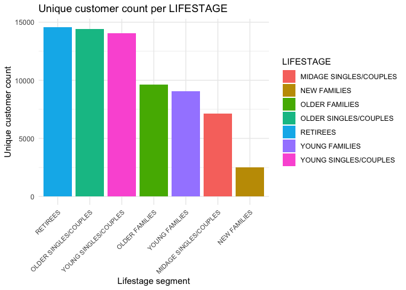
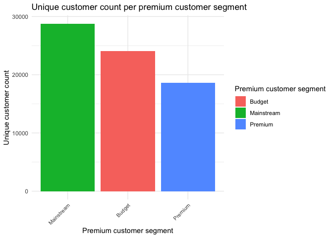
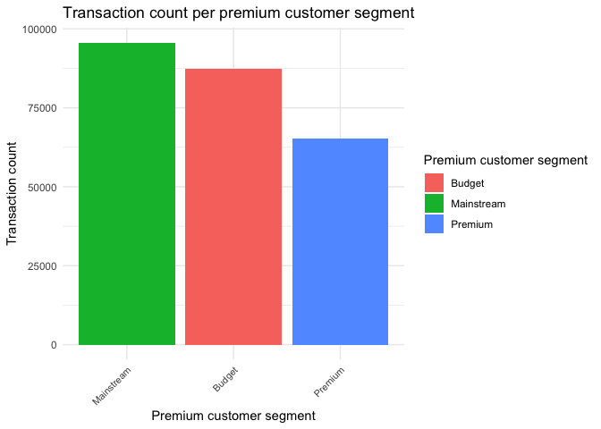
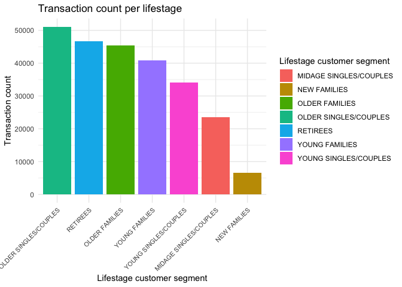
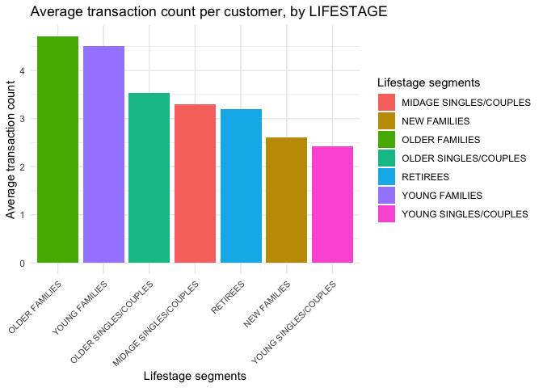
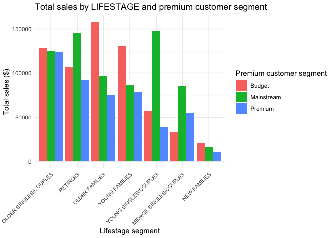
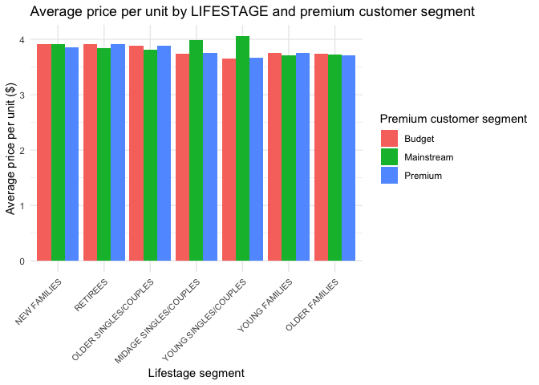
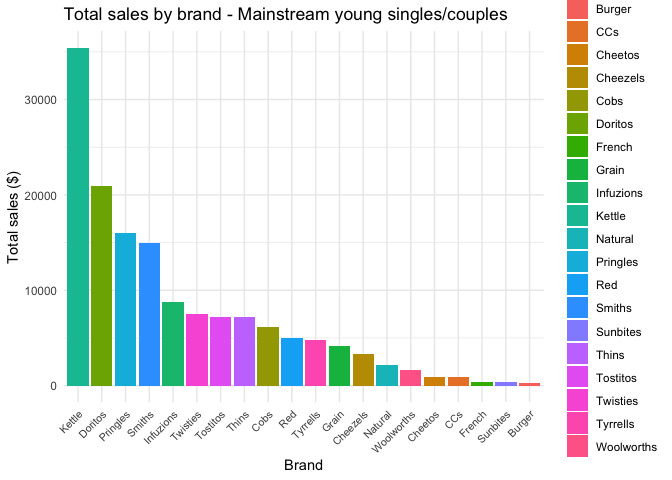
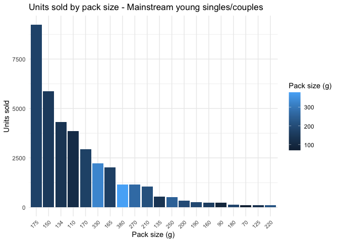
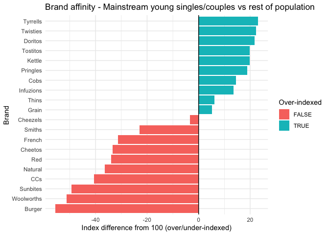

Quantium Virtual Internship - Retail Strategy and Analytics - Task 1
================
Thibaut Raiola
2026-08-03

## Load libraries and data

``` r
library(dplyr)
library(ggplot2)
library(knitr)
```

``` r
chips <- read.csv('cleaned_data.csv')
```

## Data overview

``` r
head(chips)
```

    ##         DATE STORE_NBR LYLTY_CARD_NBR TXN_ID PROD_NBR
    ## 1 2018-10-17         1           1000      1        5
    ## 2 2019-05-14         1           1307    348       66
    ## 3 2019-05-20         1           1343    383       61
    ## 4 2018-08-17         2           2373    974       69
    ## 5 2018-08-18         2           2426   1038      108
    ## 6 2019-05-16         4           4149   3333       16
    ##                                  PROD_NAME PROD_QTY TOT_SALES PACK_SIZE
    ## 1   Natural Chip        Compny SeaSalt175g        2       6.0       175
    ## 2                 CCs Nacho Cheese    175g        3       6.3       175
    ## 3   Smiths Crinkle Cut  Chips Chicken 170g        2       2.9       170
    ## 4   Smiths Chip Thinly  S/Cream&Onion 175g        5      15.0       175
    ## 5 Kettle Tortilla ChpsHny&Jlpno Chili 150g        3      13.8       150
    ## 6 Smiths Crinkle Chips Salt & Vinegar 330g        1       5.7       330
    ##   BRAND_NAME              LIFESTAGE PREMIUM_CUSTOMER
    ## 1    Natural  YOUNG SINGLES/COUPLES          Premium
    ## 2        CCs MIDAGE SINGLES/COUPLES           Budget
    ## 3     Smiths MIDAGE SINGLES/COUPLES           Budget
    ## 4     Smiths MIDAGE SINGLES/COUPLES           Budget
    ## 5     Kettle MIDAGE SINGLES/COUPLES           Budget
    ## 6     Smiths MIDAGE SINGLES/COUPLES           Budget

``` r
summary(chips)
```

    ##      DATE             STORE_NBR   LYLTY_CARD_NBR        TXN_ID       
    ##  Length:248229      Min.   :  1   Min.   :   1000   Min.   :      1  
    ##  Class :character   1st Qu.: 70   1st Qu.:  70015   1st Qu.:  67564  
    ##  Mode  :character   Median :130   Median : 130360   Median : 135150  
    ##                     Mean   :135   Mean   : 135524   Mean   : 135126  
    ##                     3rd Qu.:203   3rd Qu.: 203081   3rd Qu.: 202644  
    ##                     Max.   :272   Max.   :2373711   Max.   :2415841  
    ##     PROD_NBR    PROD_NAME            PROD_QTY       TOT_SALES     
    ##  Min.   :  1   Length:248229      Min.   :1.000   Min.   : 1.700  
    ##  1st Qu.: 27   Class :character   1st Qu.:2.000   1st Qu.: 5.800  
    ##  Median : 52   Mode  :character   Median :2.000   Median : 7.400  
    ##  Mean   : 56                      Mean   :1.906   Mean   : 7.303  
    ##  3rd Qu.: 86                      3rd Qu.:2.000   3rd Qu.: 8.800  
    ##  Max.   :114                      Max.   :5.000   Max.   :29.500  
    ##    PACK_SIZE      BRAND_NAME         LIFESTAGE         PREMIUM_CUSTOMER  
    ##  Min.   : 70.0   Length:248229      Length:248229      Length:248229     
    ##  1st Qu.:150.0   Class :character   Class :character   Class :character  
    ##  Median :170.0   Mode  :character   Mode  :character   Mode  :character  
    ##  Mean   :175.4                                                           
    ##  3rd Qu.:175.0                                                           
    ##  Max.   :380.0

``` r
str(chips)
```

    ## 'data.frame':    248229 obs. of  12 variables:
    ##  $ DATE            : chr  "2018-10-17" "2019-05-14" "2019-05-20" "2018-08-17" ...
    ##  $ STORE_NBR       : int  1 1 1 2 2 4 4 5 7 7 ...
    ##  $ LYLTY_CARD_NBR  : int  1000 1307 1343 2373 2426 4149 4196 5026 7150 7215 ...
    ##  $ TXN_ID          : int  1 348 383 974 1038 3333 3539 4525 6900 7176 ...
    ##  $ PROD_NBR        : int  5 66 61 69 108 16 24 42 52 16 ...
    ##  $ PROD_NAME       : chr  "Natural Chip        Compny SeaSalt175g" "CCs Nacho Cheese    175g" "Smiths Crinkle Cut  Chips Chicken 170g" "Smiths Chip Thinly  S/Cream&Onion 175g" ...
    ##  $ PROD_QTY        : int  2 3 2 5 3 1 1 1 2 1 ...
    ##  $ TOT_SALES       : num  6 6.3 2.9 15 13.8 5.7 3.6 3.9 7.2 5.7 ...
    ##  $ PACK_SIZE       : int  175 175 170 175 150 330 210 150 210 330 ...
    ##  $ BRAND_NAME      : chr  "Natural" "CCs" "Smiths" "Smiths" ...
    ##  $ LIFESTAGE       : chr  "YOUNG SINGLES/COUPLES" "MIDAGE SINGLES/COUPLES" "MIDAGE SINGLES/COUPLES" "MIDAGE SINGLES/COUPLES" ...
    ##  $ PREMIUM_CUSTOMER: chr  "Premium" "Budget" "Budget" "Budget" ...

## Data preparation

``` r
chips$DATE <- as.Date(chips$DATE, "%Y-%m-%d")
```

## Helper functions

``` r
create_bar_plot <- function(data, x_col, y_col, title, x_label, y_label, fill_label = x_label, text_size = 8) {
  data |> 
    ggplot(aes(x = reorder({{ x_col }}, -{{ y_col }}), y = {{ y_col }}, fill = {{ x_col }})) +
    geom_bar(stat = "identity") +
    theme_minimal() +
    theme(axis.text.x = element_text(angle = 45, hjust = 1, size = text_size)) +
    ggtitle(title) +
    labs(x = x_label, y = y_label, fill = fill_label)
}
```

## Customer segments analysis

### Number of unique customers per segment

#### By LIFESTAGE

``` r
customer_by_lifestage <- chips |> 
  group_by(LIFESTAGE) |> 
  summarise(n_customers = n_distinct(LYLTY_CARD_NBR)) |> 
  arrange(desc(n_customers))

customer_by_lifestage |> 
  ggplot(aes(x = reorder(LIFESTAGE, -n_customers), y = n_customers, fill = LIFESTAGE)) +
  geom_bar(stat = "identity") +
  theme_minimal() +
  theme(axis.text.x = element_text(angle = 45, hjust = 1, size = 8)) +
  ggtitle("Unique customer count per LIFESTAGE") +
  labs(x = "Lifestage segment", y = "Unique customer count")
```

<!-- -->

Retirees, older singles/couples, and young singles/couples segments
dominate by far, each with more than 14k unique customers. Older and
young families fall between 9k and 10k, midage singles/couples account
for around 7k, and new families represent only about 2.5k.

#### By PREMIUM_CUSTOMER

``` r
customer_by_premium_customer <- chips |> 
  group_by(PREMIUM_CUSTOMER) |> 
  summarise(n_customers = n_distinct(LYLTY_CARD_NBR)) |> 
  arrange(desc(n_customers))

create_bar_plot(
  data = customer_by_premium_customer,
  x_col = PREMIUM_CUSTOMER,
  y_col = n_customers,
  title = "Unique customer count per premium customer segment",
  x_label = "Premium customer segment",
  y_label = "Unique customer count"
)
```

<!-- -->

The mainstream segment naturally has the highest number of unique
customers (29k), followed by budget (24k) and premium (19k).

### Number of transactions per segment

#### By PREMIUM_CUSTOMER

``` r
transaction_by_premium_customer <- chips |> 
  group_by(PREMIUM_CUSTOMER) |> 
  summarise(n_transactions = n())

create_bar_plot(
  data = transaction_by_premium_customer,
  x_col = PREMIUM_CUSTOMER,
  y_col = n_transactions,
  title = "Transaction count per premium customer segment",
  x_label = "Premium customer segment",
  y_label = "Transaction count"
)
```

<!-- -->

We observe that the mainstream segment naturally accounts for the
highest number of transactions, around 94k, while the premium segment
records just over 60k transactions, and budget sits around 87k.

#### By LIFESTAGE

``` r
transaction_by_lifestage <- chips |> 
  group_by(LIFESTAGE) |> 
  summarise(n_transactions = n())

create_bar_plot(
  data = transaction_by_lifestage,
  x_col = LIFESTAGE,
  y_col = n_transactions,
  title = "Transaction count per lifestage",
  x_label = "Lifestage customer segment",
  y_label = "Transaction count"
)
```

<!-- -->

Here, the dominant segments are older singles/couples (50k), retirees
(46k), and older families (45k), which is not surprising given that the
first two also have the highest number of customers. However, while the
young singles/couples group is the 3rd largest segment in terms of
unique customers, it ranks only 5th in terms of transaction count. A
further analysis of the average number of purchases per customer by
segment will be necessary. Finally, the new families segment is by far
the smallest, with barely 7k transactions, consistent with it also
having the fewest unique customers.

#### Average transaction count per customer, by LIFESTAGE

``` r
transaction_per_customer <- chips |> 
  group_by(LYLTY_CARD_NBR, PREMIUM_CUSTOMER, LIFESTAGE) |> 
  summarise(n_transactions = n())

avg_transactions_by_lifestage <- transaction_per_customer |> 
  group_by(LIFESTAGE) |> 
  summarise(avg_transactions = round(mean(n_transactions), 2))

create_bar_plot(
  data = avg_transactions_by_lifestage,
  x_col = LIFESTAGE,
  y_col = avg_transactions,
  title = "Average transaction count per customer, by LIFESTAGE",
  x_label = "Lifestage segments",
  y_label = "Average transaction count"
)
```

<!-- -->

The young singles/couples segment ranks last, with fewer than 2.5
transactions per customer. In contrast, the older families segment
averages more than 4.5 transactions per customer, which explains the gap
observed earlier. Additionally, the young families segment shows a
strong signal, averaging 4.5 transactions per customer, well ahead of
the 3rd-ranked group (3.5).

## Financial analysis

### Total sales by segment

``` r
sales_by_segment <- chips |> 
  group_by(LIFESTAGE, PREMIUM_CUSTOMER) |> 
  summarise(total_sales = sum(TOT_SALES))

sales_by_segment |> 
  arrange(desc(total_sales))
```

    ## # A tibble: 21 x 3
    ## # Groups:   LIFESTAGE [7]
    ##    LIFESTAGE             PREMIUM_CUSTOMER total_sales
    ##    <chr>                 <chr>                  <dbl>
    ##  1 OLDER FAMILIES        Budget               157613.
    ##  2 YOUNG SINGLES/COUPLES Mainstream           147999.
    ##  3 RETIREES              Mainstream           145837.
    ##  4 YOUNG FAMILIES        Budget               130352.
    ##  5 OLDER SINGLES/COUPLES Budget               128130.
    ##  6 OLDER SINGLES/COUPLES Mainstream           125178.
    ##  7 OLDER SINGLES/COUPLES Premium              124067.
    ##  8 RETIREES              Budget               106276.
    ##  9 OLDER FAMILIES        Mainstream            96927.
    ## 10 RETIREES              Premium               91669.
    ## # i 11 more rows

``` r
sales_by_lifestage_total <- sales_by_segment |> 
  group_by(LIFESTAGE) |> 
  summarise(total_sales = sum(total_sales)) |> 
  arrange(desc(total_sales))

sales_by_lifestage_total |>
  kable(caption = "Total sales by LIFESTAGE")
```

| LIFESTAGE              | total_sales |
|:-----------------------|------------:|
| OLDER SINGLES/COUPLES  |   377375.15 |
| RETIREES               |   343781.90 |
| OLDER FAMILIES         |   330180.00 |
| YOUNG FAMILIES         |   296015.40 |
| YOUNG SINGLES/COUPLES  |   244478.10 |
| MIDAGE SINGLES/COUPLES |   173391.70 |
| NEW FAMILIES           |    47510.15 |

Total sales by LIFESTAGE

``` r
sales_by_segment |> 
  ggplot(aes(x = reorder(LIFESTAGE, -total_sales, sum), y = total_sales, fill = PREMIUM_CUSTOMER)) +
  geom_bar(stat = "identity", position = "dodge") +
  theme_minimal() +
  theme(axis.text.x = element_text(angle = 45, hjust = 1, size = 8)) +
  ggtitle("Total sales by LIFESTAGE and premium customer segment") +
  labs(x = "Lifestage segment", y = "Total sales ($)", fill = "Premium customer segment")
```

<!-- -->

First, no LIFESTAGE segment has the Premium customer segment as its main
contributor to sales. Only the ‘Older singles/couples’ segment shows
notable interest from Premium customers, with an almost even split
across the 3 customer segments, and the ‘Midage singles/couples’
LIFESTAGE, where Premium customers rank 2nd, well ahead of Budget
customers.

The Mainstream customer segment is particularly dominant among ‘Young
singles/couples’, reflecting the mainstream positioning of these
products. In fact, for this specific case, the Mainstream segment
outweighs the other two segments combined, a unique case here. Among
‘Retirees’, the order is the same (Mainstream - Budget - Premium), but
with a strong, though less overwhelming, dominance of the first.

Regarding the Budget customer segment, a fairly similar situation
emerges: among ‘Older families’ and ‘Young families’, this segment
clearly dominates sales; the order remains the same, with Mainstream in
2nd position, closely followed by Premium.

Finally, ‘New families’ show a total sales figure so low that it risks
skewing the analysis, but contributions are fairly balanced across
segments: Budget represents twice as much as Premium, with Mainstream
sitting in between.

### Average price per unit, by LIFESTAGE

``` r
chips <- chips |> 
  mutate(price_per_unit = TOT_SALES / PROD_QTY)
```

``` r
avg_price_per_unit <- chips |> 
  group_by(LIFESTAGE, PREMIUM_CUSTOMER) |> 
  summarise(avg_price_per_unit = mean(price_per_unit))

avg_price_per_unit |> 
  group_by(LIFESTAGE) |> 
  summarise(avg_price = round(mean(avg_price_per_unit), 2)) |> 
  arrange(desc(avg_price))
```

    ## # A tibble: 7 x 2
    ##   LIFESTAGE              avg_price
    ##   <chr>                      <dbl>
    ## 1 NEW FAMILIES                3.89
    ## 2 RETIREES                    3.89
    ## 3 OLDER SINGLES/COUPLES       3.86
    ## 4 MIDAGE SINGLES/COUPLES      3.83
    ## 5 YOUNG SINGLES/COUPLES       3.79
    ## 6 YOUNG FAMILIES              3.74
    ## 7 OLDER FAMILIES              3.73

``` r
avg_price_per_unit |> 
  ggplot(aes(x = reorder(LIFESTAGE, -avg_price_per_unit), y = avg_price_per_unit, fill = PREMIUM_CUSTOMER)) +
  geom_bar(stat = "identity", position = "dodge") +
  theme_minimal() +
  theme(axis.text.x = element_text(angle = 45, hjust = 1, size = 8)) +
  ggtitle("Average price per unit by LIFESTAGE and premium customer segment") +
  labs(x = "Lifestage segment", y = "Average price per unit ($)", fill = "Premium customer segment")
```

<!-- -->

Overall, the differences in average price per unit are not significant
across the different LIFESTAGE segments, all ranging between \$3.73 and
\$3.89. Moreover, with rare exceptions, within a given LIFESTAGE
segment, the different customer segments show relatively balanced
averages.

The LIFESTAGE segments with the highest average price per unit are new
families and retirees, both averaging \$3.89 across all customer
segments combined. At the other end, older families and young families
show the lowest averages, at \$3.73 and \$3.74 respectively.

However, among midage singles/couples and young singles/couples, the
Mainstream segment shows a notably higher average compared to the other
customer segments within the same group. In fact, only the Mainstream
segment among young singles/couples has an average above \$4.

### Statistical significance test

``` r
target_segment <- chips |> 
  filter(LIFESTAGE %in% c("YOUNG SINGLES/COUPLES", "MIDAGE SINGLES/COUPLES"))

mainstream_prices <- target_segment |> 
  filter(PREMIUM_CUSTOMER == 'Mainstream') |> 
  pull(price_per_unit)

budget_premium_prices <- target_segment |> 
  filter(PREMIUM_CUSTOMER != 'Mainstream') |> 
  pull(price_per_unit)

t.test(mainstream_prices, budget_premium_prices)
```

    ## 
    ##  Welch Two Sample t-test
    ## 
    ## data:  mainstream_prices and budget_premium_prices
    ## t = 37.796, df = 55213, p-value < 2.2e-16
    ## alternative hypothesis: true difference in means is not equal to 0
    ## 95 percent confidence interval:
    ##  0.3166391 0.3512758
    ## sample estimates:
    ## mean of x mean of y 
    ##  4.033359  3.699402

With a p-value below 2.2e-16, the observed difference between customer
segments is very likely real. The \$0.33 difference, or 9%, indicates a
non-negligible gap at scale. Finally, we can be 95% confident that the
true difference between the observed segments lies between \$0.316 and
\$0.351.

### Deep dive - Mainstream young singles/couples

``` r
revenue_by_brand_target_segment <- chips |> 
  filter(PREMIUM_CUSTOMER == 'Mainstream') |> 
  filter(LIFESTAGE == 'YOUNG SINGLES/COUPLES') |> 
  group_by(BRAND_NAME) |> 
  summarise(tot = sum(TOT_SALES))

revenue_by_brand_target_segment |> 
  arrange(desc(tot))
```

    ## # A tibble: 20 x 2
    ##    BRAND_NAME    tot
    ##    <chr>       <dbl>
    ##  1 Kettle     35424.
    ##  2 Doritos    20926.
    ##  3 Pringles   16006.
    ##  4 Smiths     14928.
    ##  5 Infuzions   8749.
    ##  6 Twisties    7540.
    ##  7 Tostitos    7238.
    ##  8 Thins       7217.
    ##  9 Cobs        6145.
    ## 10 Red         4958.
    ## 11 Tyrrells    4801.
    ## 12 Grain       4201.
    ## 13 Cheezels    3318.
    ## 14 Natural     2130 
    ## 15 Woolworths  1606.
    ## 16 Cheetos      899.
    ## 17 CCs          851.
    ## 18 French       429 
    ## 19 Sunbites     391.
    ## 20 Burger       244.

``` r
create_bar_plot(
  data = revenue_by_brand_target_segment,
  x_col = BRAND_NAME,
  y_col = tot,
  title = "Total sales by brand - Mainstream young singles/couples",
  x_label = "Brand",
  y_label = "Total sales ($)"
)
```

<!-- -->

We observe a clear dominance from the Kettle brand, which records more
than \$35,000 in sales, while the runner-up, Doritos, sits at only
\$20,925, and Pringles ranks third with \$16,000.

``` r
pack_size_target_segment <- chips |> 
  filter(PREMIUM_CUSTOMER == 'Mainstream') |> 
  filter(LIFESTAGE == 'YOUNG SINGLES/COUPLES') |> 
  group_by(PACK_SIZE) |> 
  summarise(units_sold = sum(PROD_QTY))

pack_size_target_segment |> 
  arrange(desc(units_sold))
```

    ## # A tibble: 20 x 2
    ##    PACK_SIZE units_sold
    ##        <int>      <int>
    ##  1       175       9237
    ##  2       150       5863
    ##  3       134       4326
    ##  4       110       3850
    ##  5       170       2926
    ##  6       330       2220
    ##  7       165       2016
    ##  8       380       1165
    ##  9       270       1153
    ## 10       210       1055
    ## 11       135        535
    ## 12       250        520
    ## 13       200        325
    ## 14       190        271
    ## 15       160        232
    ## 16        90        230
    ## 17       180        130
    ## 18        70        110
    ## 19       125        109
    ## 20       220        106

``` r
create_bar_plot(
  data = pack_size_target_segment,
  x_col = PACK_SIZE,
  y_col = units_sold,
  title = "Units sold by pack size - Mainstream young singles/couples",
  x_label = "Pack size (g)",
  y_label = "Units sold"
)
```

<!-- -->

We notice that the most popular pack size is 175g, with more than 9,000
units sold, while in second position we find 150g packs, with nearly
6,000 units sold, and rounding out the podium, 134g packs with 4,300
units.

``` r
brand_pct_target <- chips |> 
  filter(PREMIUM_CUSTOMER == 'Mainstream', LIFESTAGE == 'YOUNG SINGLES/COUPLES') |> 
  group_by(BRAND_NAME) |> 
  summarise(units = sum(PROD_QTY)) |> 
  mutate(pct_target = units / sum(units) * 100)

brand_pct_rest <- chips |> 
  filter(PREMIUM_CUSTOMER != 'Mainstream' | LIFESTAGE != 'YOUNG SINGLES/COUPLES') |> 
  group_by(BRAND_NAME) |> 
  summarise(units = sum(PROD_QTY)) |> 
  mutate(pct_rest = units / sum(units) * 100)

brand_affinity <- brand_pct_target |> 
  select(BRAND_NAME, pct_target) |> 
  left_join(brand_pct_rest |> select(BRAND_NAME, pct_rest), by = "BRAND_NAME") |> 
  mutate(affinity_index = round(pct_target / pct_rest * 100, 1))

brand_affinity |> 
  mutate(diff_from_avg = affinity_index - 100) |> 
  ggplot(aes(x = reorder(BRAND_NAME, diff_from_avg), y = diff_from_avg, fill = diff_from_avg > 0)) +
  geom_col() +
  geom_hline(yintercept = 0) +
  coord_flip() +
  theme_minimal() +
  labs(
    title = "Brand affinity - Mainstream young singles/couples vs rest of population",
    x = "Brand",
    y = "Index difference from 100 (over/under-indexed)",
    fill = "Over-indexed"
  )
```

<!-- -->

We clearly observe a preference for certain brands within our target
segment: brands such as Tyrrells, Twisties, and Doritos show sales
volumes around 20% higher among our target group. Conversely, the Burger
and Woolworths brands show a -40% difference.

Finally, regarding the brands previously identified as the most popular
(Kettle, Doritos, and Pringles), we observe that they are also consumed
more within this group, by an average of 20%, compared to the rest of
the population.
